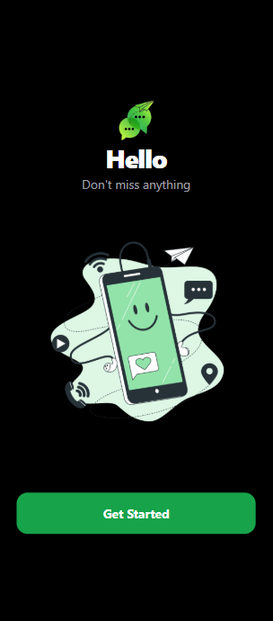
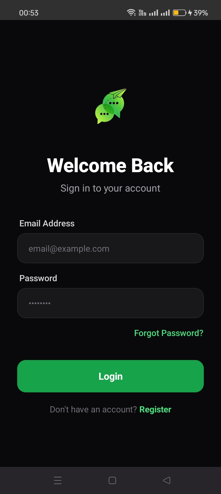
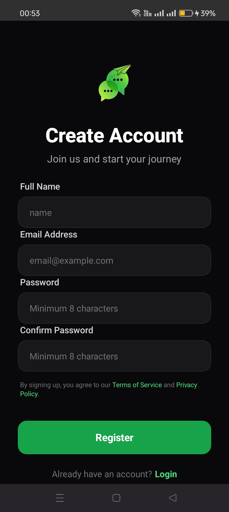
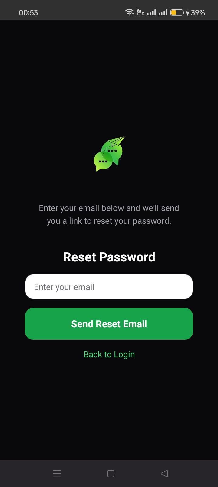
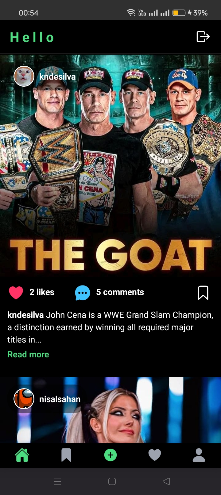
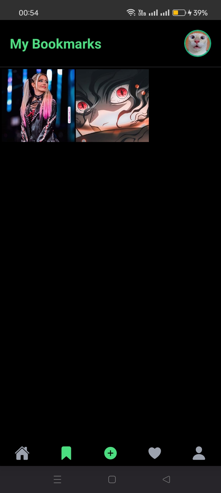
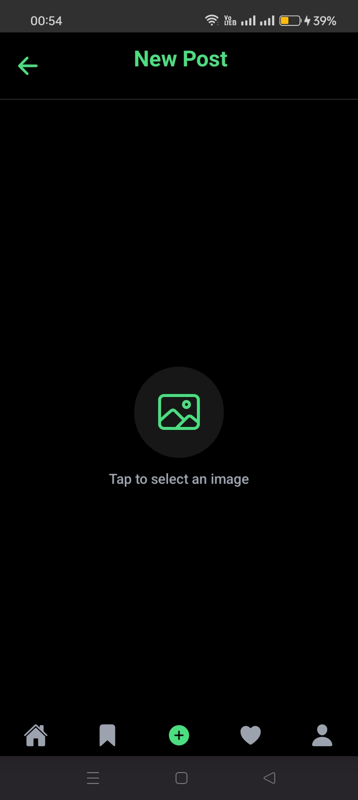
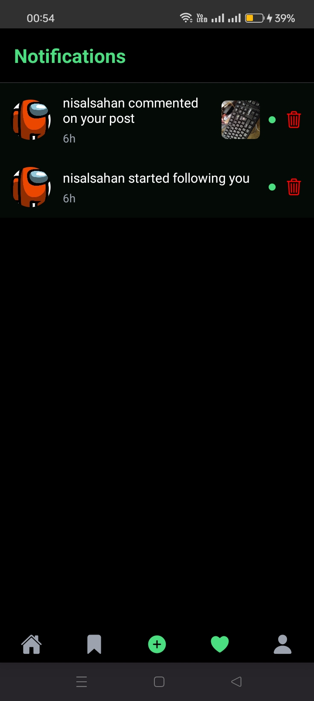
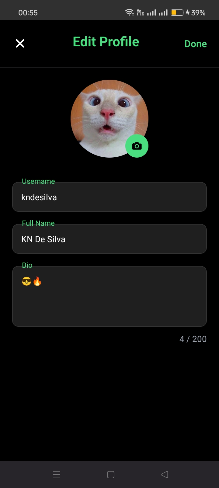
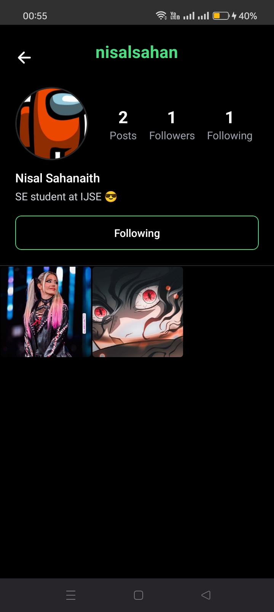

<h1 style="display: flex; align-items: center;">
  
  Hello – Social Mobile App
</h1>

**Hello** is a modern, high-performance social media mobile application inspired by Instagram.  
Built with **Expo** (React Native), it delivers a clean, smooth, and interactive experience for sharing moments, discovering content, and connecting with others.

## ✨ Key Features

- **Secure Authentication** — Email/password + Password reset using Firebase Authentication
- **Dynamic Home Feed** — Infinite scroll / pagination with lazy loading
- **Cloud Media Handling** — Fast image uploads, automatic optimization & transformations via Cloudinary
- **Real-time Interactions** — Instant likes, comments, follow/unfollow using Firestore real-time listeners
- **Smart Notifications** — Push-style in-app notifications for likes, comments, new followers (with read/unread status)
- **Rich User Profiles** — Bio, avatar upload, post/follower/following counts
- **Post Bookmarking** — Save favorite posts for later viewing
- **Post Creation** — Intuitive flow to capture/upload and share new content

## 📸 App Screenshots

> ⚠️ Make sure your screenshots are inside `assets/images/hello-mobile-screenshots/` folder.

### Onboarding & Authentication

| Get Started | Login | Register | Forget Password |
|------------|-------|---------|----------------|
|  |  |  |  |

### Main App Tabs
| Home Feed | Bookmarks | Create Post | Notifications | Profile |
|-----------|----------|------------|--------------|--------|
|  |  |  |  |  |

### Profile Screens
| Edit Profile | Follow Preview |
|-------------|----------------|
|  |  |


## 🛠 Tech Stack

- **Framework**: Expo (React Native)  
- **Styling**: NativeWind v4 (Tailwind CSS for React Native)  
- **Backend & Database**: Firebase (Firestore + Firebase Authentication)  
- **Media Storage & CDN**: Cloudinary  
- **Navigation**: Expo Router (file-based routing)  
- **State Management**: React Context API  

## 🏗 Architecture Highlights

- **Provider Pattern** — `AuthProvider` + `LoaderProvider` for global, stable state  
- **Service Layer** — `authService`, `postsService`, `followService`, `notificationService`, etc.  
- **Optimized Firestore Usage** — Sub-collections for likes/comments, batched writes, efficient queries & real-time snapshots  
- **Modular & Scalable** — Easy to extend with new features  

## ⚙️ Prerequisites

- Node.js ≥ 18  
- npm ≥ 9 or yarn / pnpm  
- Expo CLI (`npm install -g expo-cli`)  
- Firebase project & Cloudinary account  

## 🚀 Installation & Setup

1. Clone the repository

   ```bash
   git clone https://github.com/kameshNethsara/hello-mobile
   cd hello-mobile
   ```

2. Install dependencies

   ```bash
   npm install
   # or
   yarn install
   ```

3. Configure environment variables

   Create `.env` in the root (or use EAS Secrets for builds):

   ```env
   EXPO_PUBLIC_FIREBASE_API_KEY=your_api_key
   EXPO_PUBLIC_FIREBASE_AUTH_DOMAIN=your_auth_domain
   EXPO_PUBLIC_FIREBASE_PROJECT_ID=your_project_id
   EXPO_PUBLIC_FIREBASE_STORAGE_BUCKET=your_storage_bucket
   EXPO_PUBLIC_FIREBASE_MESSAGING_SENDER_ID=your_sender_id
   EXPO_PUBLIC_FIREBASE_APP_ID=your_app_id

   EXPO_PUBLIC_CLOUDINARY_CLOUD_NAME=your_cloud_name
   EXPO_PUBLIC_CLOUDINARY_UPLOAD_PRESET=your_upload_preset   # optional

   EXPO_PUBLIC_GOOGLE_CLIENT_ID_ANDROID=your_android_client_id
   EXPO_PUBLIC_GOOGLE_CLIENT_ID_IOS=your_ios_client_id
   ```

4. Start the development server

   ```bash
   npx expo start
   # or
   npm run start
   ```

   Then press `a` (Android), `i` (iOS simulator), or scan the QR code with Expo Go.

## 📥 Download APK

You can download the latest **Hello App APK** for Android here:

<p align="center">
  <a href="apk/v1/application-a9fd09c4-3680-49c9-93f5-622a5cd4e2a7.apk" download>
    
  </a>
</p>


> ⚠️ Note: Make sure to allow installation from unknown sources on your device settings before installing.


## 🛡️ Security & Deployment Notes

- All sensitive keys are managed via **EAS Secrets** during production builds → never committed to Git.
- Use `.env.local` or `.env.development` for local dev (gitignore'd).
- Firebase security rules and Cloudinary signed uploads are strongly recommended for production.

## 📄 License

MIT License

See [LICENSE](./LICENSE) for details.

## ❤️ Acknowledgments & Credits

- **Built with ❤️ by Kamesh Nethsara** – Passionate about creating clean, interactive, and modern mobile experiences.  
- **Inspired by popular social platforms** like Instagram, TikTok, and Twitter.  
- **Powered by amazing tools & libraries**:
  - [Expo](https://expo.dev/) – For smooth React Native development
  - [Firebase](https://firebase.google.com/) – Authentication, Firestore, and real-time features
  - [Cloudinary](https://cloudinary.com/) – Fast and optimized media handling
  - [NativeWind](https://www.nativewind.dev/) – Tailwind CSS for React Native
- Special thanks to **open-source contributors** and the community for tutorials, documentation, and support.  

> Contributions, bug reports, and feature suggestions are always welcome!

